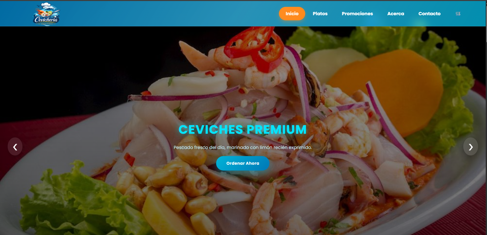

#  Cevichería El Sabor Marino

Aplicación web moderna para la gestión de una cevichería**, con interfaz interactiva, animaciones marinas y sistema de pedidos.

---


##  Vista previa



---

##  Características

* 🐟 Animaciones marinas (peces, burbujas, algas)
* 🍽️ Menú interactivo de platos
* 🛒 Carrito de compras dinámico
* 🎨 Diseño moderno y atractivo
* 📱 Responsive (adaptable a celulares y tablets)

---

## 🛠️ Tecnologías usadas

| Tecnología      | Descripción           |
| --------------- | --------------------- |
| 🐍 Python       | Backend con Django    |
| 🌐 HTML5        | Estructura web        |
| 🎨 CSS3         | Estilos y animaciones |
| ⚡ JavaScript    | Interactividad        |
| 🎠 Owl Carousel | Carrusel dinámico     |

---

## 📂 Estructura del proyecto

```
SEVICHERIA/
│── core/
│── menu/
│── templates/
│   └── home.html
│── static/
│   └── assets/
│       ├── css/
│       │   └── estilo.css
│       ├── img/
│       └── js/
│           └── carrusel.js
│── manage.py
│── db.sqlite3
│── requirements.txt
```

---

## ⚙️ Instalación

1️⃣ Clonar el repositorio:

```
git clone https://github.com/diazdavilajesus16-stack/Sevicheria-Mar-sabroso.git
```

2️⃣ Instalar dependencias:

```
pip install -r requirements.txt
```

3️⃣ Ejecutar servidor:

```
python manage.py runserver
```

4️⃣ Abrir en el navegador:

```
http://127.0.0.1:8000/
```

---

## 🌐 Funcionalidades destacadas

✔ Navegación fluida
✔ Interfaz animada
✔ Experiencia visual atractiva
✔ Base lista para e-commerce

---

## 📌 Próximas mejoras

* 💳 Integración de pagos
* 🔐 Sistema de autenticación de usuarios
* 📦 Gestión avanzada de pedidos
* ☁️ Despliegue en servidor (Render / Railway)

---

## 👨‍💻 Autor

**Teresa Diaz** 💙
📍 Perú
💻 Estudiante de Ingeniería de Software SENATI

---

## ⭐ Apoya el proyecto

Si te gusta este proyecto:

👉 Dale ⭐ en GitHub
👉 Compártelo
👉 Úsalo como base para tus propios proyectos

---

## 💡 Frase del proyecto

*"El mejor sabor del mar, ahora en la web"* 🌊🐟
